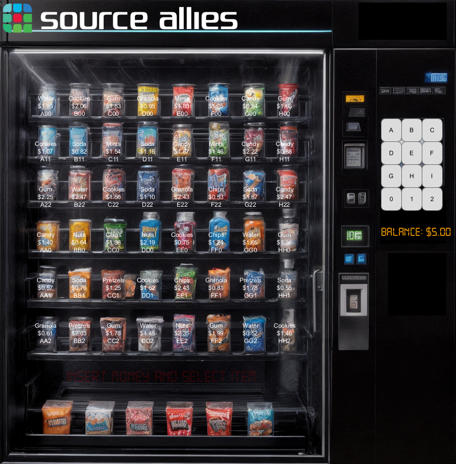

# VenDDing - Vending Machine Simulator

A Processing-based vending machine simulator created as a solution to the [Vending Machine Kata](https://www.codewars.com/kata/586ee462d0982081bf001f07) on Codewars.

## Features

- Interactive vending machine interface with keypad input
- Digital display showing current code, balance, and messages
- Item selection with unique codes
- Money handling and change calculation
- Inventory management
- Smooth animations and fade effects
- Custom digital font for displays

## Implementation Details

The project is built using Processing and consists of several key components:

- `VenDDing.pde`: Main sketch file handling setup and draw loops
- `Button.pde`: Button class for keypad and item selection
- `Item.pde`: Item class for vending machine products
- `VendingMachine.pde`: Core vending machine logic

## Requirements

- Processing 4.x
- Digital-7 font (included in data folder)

## Usage

1. Open the project in Processing
2. Run the sketch
3. Use the keypad to enter item codes
4. Insert money and select items
5. Collect your items and change

## License

This project is licensed under the MIT License - see the [LICENSE](LICENSE) file for details.
